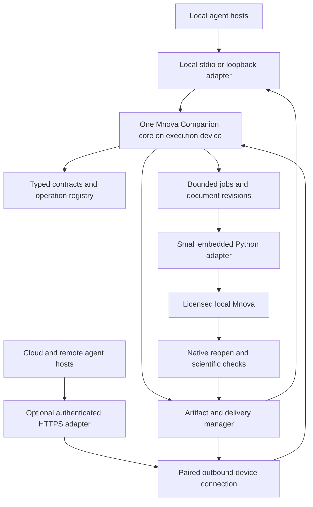

# Mnova Companion: architecture and implementation plan

Date: 2026-09-15

Status: **Implementation approved; development checkpoint, native writes disabled**

Shared baseline: **Chembridge 2026-09-14.1**

Working product identity: **Mnova Companion**; independent of Mestrelab and the University of Edinburgh.

Implementation update: the user approved development after this plan was delivered.
The product now has its own [repository](https://github.com/saigyujikingyo-png/mnova-companion)
and saved Codex cloud environment. See the [current development receipt](../verification/2026-09-15-mnova-development.md)
and [product status](https://github.com/saigyujikingyo-png/mnova-companion/blob/codex/initial-preview/docs/STATUS.md).
The design-stage ledger below is retained as a historical baseline; native lifetime
testing subsequently failed and production scientific writes remain disabled.

Follow-up: an original icon and current-device Codex preview are now installed.
See the [installation record](https://github.com/saigyujikingyo-png/mnova-companion/blob/codex/initial-preview/docs/INSTALLATION.md)
and [assessment with the next technical route](https://github.com/saigyujikingyo-png/mnova-companion/blob/codex/initial-preview/docs/NEXT_TECHNICAL_ROUTE.md).
The user subsequently approved R0/R1 development. Its session-lifecycle harness is
implemented. After the [original R0 failure](https://github.com/saigyujikingyo-png/mnova-companion/blob/codex/initial-preview/docs/SESSION_LIFECYCLE_R0.md),
the [2026-09-16 diagnostic](https://github.com/saigyujikingyo-png/mnova-companion/blob/codex/initial-preview/docs/SESSION_DIAGNOSTIC_20260916.md)
fixed zero-page canvas observation and passed session creation plus independent
synthetic readback. Existing-document activation returned without changing the
active document or visible tab. A distinct main-window New action subsequently
passed visible ownership, genuine dirty state and independent readback: R0 passed
within that bounded scope. R1 then failed: its target-close sequence removed the
protected synthetic sentinel while retaining the intended target. All native
writes stopped and a dedicated close gate is disabled. Scientific workflows
remain blocked. See the [current hub checkpoint](../verification/2026-09-16-mnova-r1.md).

## 1. Decision and scope

Build one agent-facing plugin that turns natural-language requests into reproducible operations in a user's licensed MestReNova installation. Its primary deliverable is an editable native `.mnova` document, accompanied by useful figures, numerical tables, processing provenance and separately recorded delivery evidence.

Use an external Python MCP core and a small adapter inside Mnova. Prefer the current Mnova Python engine for the first Windows 17.x target. Keep legacy JavaScript behind the same native-adapter boundary only where a verified API gap requires it. Scientific processing stays in Mnova; the external core manages contracts, jobs, files, provenance and host delivery.

The first release candidate covers **1D NMR processing and continued editing**. Broader Mnova capabilities remain part of the product roadmap, with their own module, licence, numerical and delivery gates. The design does not require Gears, a second model service, a central database, or a cloud copy of licensed desktop software.

This plan follows [the shared principles](../DEVELOPMENT_PRINCIPLES.md), [cloud development](../CLOUD_DEVELOPMENT.md), [storage policy](../CLOUD_STORAGE.md), [project catalog](../project-catalog.json), [new-plugin checklist](../templates/NEW_PLUGIN.md) and [contributor template](../templates/AGENTS.md).

### Design-stage evidence ledger (before implementation approval)

| Area | State | Evidence and limits |
| --- | --- | --- |
| Shared rules and product plan | READY | Required hub entrypoints read; this document defines the proposed implementation and acceptance gates. READY here applies to planning only. |
| Vendor interface research | PARTIAL | Current official 17.x documentation establishes a Python extension route. Exact signatures, triggering, cancellation and save/reopen behaviour need a native feasibility test. |
| Existing development device | PARTIAL | Read-only uninstall registration reports `17.0.41952`; executable metadata reports `17.0.1-41952`, product version `17.0`. No launch or licence check was performed. |
| University applicability | PARTIAL | Official public sources establish student software access and NMR teaching relevance. Exact campus build, module entitlements and course-specific instructions remain unknown. |
| Product implementation and output schemas | NOT STARTED | No product code, executable schemas, native scripts or package exists as a result of this task. |
| Product repository and cloud environment | NOT CREATED | Names and setup below are proposals; no catalog entry or environment claim has been added. |
| Native, host, model and file-delivery acceptance | NOT RUN | None is inherited from Origin, ChemDraw, UoE or another machine. |
| Blocking planning issues | NONE | The unresolved native questions are explicit phase-0 gates, not obstacles to completing the design. |

## 2. Evidence that determines the architecture

All external sources below were consulted on 2026-09-15. Documentation establishes an available design direction; it does not establish acceptance on the installed build.

| Finding | Source | Design consequence |
| --- | --- | --- |
| Mnova 17 includes a Python 3.11 interpreter and adds phase, integral, multiplet and assignment capabilities; JavaScript remains documented. | [Official Mnova 17 changelog](https://support.mestrelab.com/kb/article/567-what-s-new-in-mnova-17-changelog/) | Start with a Python native adapter on 17.x. Do not assume an old JavaScript-only integration or external importability of proprietary Python modules. |
| Mnova 17 adds the `.mnjs` JSON document format. | [Official Mnova 17 changelog](https://support.mestrelab.com/kb/article/567-what-s-new-in-mnova-17-changelog/) | Consider it for optional interoperability after fidelity tests. Keep `.mnova` and the original raw data as the primary acceptance targets. |
| The official scripting guide describes script execution, editing and menu integration. | [Mestrelab scripting guide](https://mestrelab.com/starting-guides/how-to-get-started-with-mnova-scripts.html) | A supported script bootstrap is plausible. Its exact operation with the current Python engine and existing documents is a phase-0 question. |
| The official Python series covers filesystem operations, document objects, processing templates and NMR result extraction. | [Mnova Python automation series](https://mestrelab.com/resources/mnova-python-the-holy-grail-of-automation.html) | Use documented native operations; inspect the installed build's symbols before writing the adapter. |
| The version-15 command-line documentation describes `-sf` for script functions and `-w` forwarding work to an already running instance. | [Version-15 command-line manual](https://www.mestrelabcn.com/Manual_HTML_Mnova_15/new_item.htm) | Do not use `-w` as an isolation flag. Neither these flags nor Python equivalents have been tested on the installed 17.x build. |
| The unversioned official QtScript reference describes document construction, saving, PDF export and file/event facilities. | [QtScript API reference](https://mestrelab.com/files/scripting/mnova-scripting.html#object-Document) | These are feasibility clues, not verified Python bindings or a guaranteed native RPC service. |
| The official site distributes Mnova Console 17.0.1 separately. | [Mnova Console downloads](https://mestrelab.com/mnova-console) | Retain a possible Console executor boundary. Download availability alone establishes neither entitlement nor desktop-equivalent output. |
| Gears addresses batch workflows; MyGears addresses workflows on an open document. | [Mnova Gears](https://mestrelab.com/main-product/gears), [Mnova MyGears](https://mestrelab.com/main-product/mygears) | Evaluate them for later advanced automation only when justified by a requested workflow and verified entitlement. |
| The School of Chemistry publishes an MNova software entry with university access guidance. | [Computing software for chemistry students](https://chem.ed.ac.uk/cto/student-support/computing-software) | Use the user's lawful university installation. Do not bundle vendor installers, licences or intranet materials. |
| Chemistry 1B includes NMR interpretation; PGT laboratory teaching includes spectroscopic characterisation and reporting. | [Chemistry 1B, 2026/27](https://www.drps.ed.ac.uk/current/dpt/cxchem08017.htm), [Laboratory Techniques 1 Chemistry PGT, 2026/27](https://www.drps.ed.ac.uk/current/dpt/cxchem11082.htm) | Support learning, data processing and report preparation. Obtain the actual relevant lab instructions before claiming course-format compliance. |
| The university NMR facility lists Bruker instruments. | [NMR facility](https://chem.ed.ac.uk/research/facilities-capabilities/nuclear-magnetic-resonance-reaction-mechanism) | Prioritising a public or synthetic Bruker-format fixture is a design inference; this confers no access to facility data. |

### Candidate execution routes

| Route | Decision | Gate before use |
| --- | --- | --- |
| Mnova 17 embedded Python | Preferred native adapter | Discover exact local API and supported script/plugin loading; import, mutate, save, close and reopen an isolated test document. |
| Mnova JavaScript / `.qs` | Compatibility option | Verify a required gap and the installed scripting API. Keep workflow rules and public contracts in the core. |
| Mnova Console | Optional future executor | Verify acquisition, licence scope, command semantics, file fidelity and supported OS separately. |
| Gears / MyGears | Optional future workflow integration | Verify relevant product entitlement and value beyond bounded script-driven work. |
| GUI interaction | Bounded setup or explicitly labelled assisted fallback | Detect the current UI and preserve the user's session. GUI assistance cannot silently count as unattended API acceptance. |

The adapter interface is fixed at this stage; the exact native bootstrap remains a deliberate phase-0 decision. Do not invent a Python command-line flag, assume arbitrary Python packages can import Mnova, or assume that starting a second process isolates documents.

Gears has its own documented order-file integration. The proposed small request/receipt interface here would be implemented by Mnova Companion; it is not a claim that ordinary Mnova already supplies the Gears job protocol. [Official Gears integration article](https://mestrelab.com/articles/no-automation-is-an-island-integrating-mgears-into-your-it-infrastructure.html)

## 3. User workflows and release boundaries

### First usable Windows preview

1. **Inspect and open:** accept a user-selected raw dataset or `.mnova` file; preserve raw directory relationships; identify dimensions, nucleus, acquisition metadata, processing state and available modules. Copy authorised inputs into an isolated job directory.
2. **Process 1D NMR:** apply a versioned, inspectable Mnova recipe for appropriate Fourier processing, phase and baseline correction, referencing, peak picking, integration and supported multiplet analysis. Detect already processed inputs to avoid applying the processing chain twice.
3. **Continue editing:** change specified integral regions, referencing, labels, displayed range or reporting precision in a new document revision. Preserve unrelated spectra, pages, objects and prior outputs.
4. **Review and explain:** return the actual observed peak/integral/multiplet values with methods and warnings. Separate measured properties, user assignments and agent interpretation.
5. **Deliver:** return the native document plus a preview, peak/integral tables and a short method report. Reopen the native file before declaring native verification complete; verify the receiving host separately.

Example requests: “Process this proton NMR dataset and give me an editable Mnova file”; “Set this reference peak to the specified chemical shift and revise these integration regions”; “Keep the processing unchanged and prepare a labelled spectrum and peak table.” The agent handles tool parameters; ordinary users do not write scripts or JSON.

Initial fixtures cover 1H and 13C 1D spectra, with separate recipes and assertions. Relative proton integration does not imply quantitative concentration or purity. Routine decoupled 13C spectra must not be presented as quantitative carbon counts.

### Later capability increments

| Increment | Candidate capabilities | Additional requirements |
| --- | --- | --- |
| 2D NMR | COSY, HSQC, HMBC, correlations, overlays and supported assignments | Experiment-specific processing, axes/signs and peak checks; native API coverage and licence validation. |
| Bounded batches | A small user-selected dataset list and per-sample results | Item-level idempotency and provenance; mixed failures cannot become aggregate success. |
| Quantitative methods | qNMR, purity, concentration, kinetics or DOSY when supported | Valid method, standards, acquisition suitability, units, fit assumptions and uncertainty; extra module entitlements where applicable. |
| Structure workflows | User-supplied structures, assignments, prediction and verification | Atom-ID mapping, supported native APIs and actual module/network permissions; predictions remain distinct from experimental observations. |
| Other Mnova modules | MS/LC/GC and other requested licensed analyses | Their own import providers, scientific contracts and acceptance datasets. |
| Other desktop platforms | macOS and Linux builds | Separate native adapters/packaging and acceptance; no Windows result implies a pass elsewhere. |

The preview does not include instrument acquisition/control, autonomous declarations of structural identity, modification of shared research databases, or unsolicited upload to vendor prediction services. Such work needs an explicit product increment and corresponding acceptance requirements.

## 4. Components and ownership



### Host-neutral core

- External Python 3.12 runtime; bundle it for ordinary Windows users. Mnova's embedded Python 3.11 stays a separate interpreter and dependency environment.
- Use the official MCP Python SDK, shared typed models and server-side validation. Select and lock an exact supported SDK release when the product repository is created; never depend on an unbounded latest release. The current official SDK documentation identifies a v2 line and earlier-protocol support, but that is not host compatibility evidence. [SDK source](https://github.com/modelcontextprotocol/python-sdk)
- Reuse Pydantic for strict typed validation and schema generation where compatible with the chosen SDK. Include semantic validators for finite numbers, units, bounds and state invariants; schema generation alone is insufficient. [Strict validation](https://docs.pydantic.dev/latest/concepts/strict_mode/), [schema generation](https://docs.pydantic.dev/latest/concepts/json_schema/)
- Keep standard-library file manifests, hashes, atomic writes and bounded job records. Start with one executor queue and no database server. Add a local persistent index only after measured retrieval needs justify it.
- Do not install external dependencies into Mnova's embedded interpreter for the first adapter. Its responsibilities should fit the vendor API and available standard library.
- Native operations use reviewed packaged code and validated data arguments. The public interface does not expose `eval`, arbitrary shell commands or unrestricted scripts.

### Native adapter

Conceptual internal operations: `probe`, `open_copy`, `inspect_document`, `apply_recipe`, `apply_edit`, `export`, `save_revision`, `reopen_verify`, and `close_owned_document`. These are proposed adapter methods, not claims about vendor function names.

Start with a private file request/receipt boundary on the execution device. A supported bootstrap loads the packaged adapter; the adapter consumes a bounded request with a job ID and writes a typed receipt plus artifacts. Requests contain data and operation IDs, not executable code.

The actual trigger must be demonstrated first: supported command invocation if suitable, otherwise a vendor-supported in-application plugin/event entrypoint. Do not assume timer APIs, a built-in HTTP server, Python command-line syntax or safe background access to native objects. Keep all Mnova object operations on the supported application thread. If automatic triggering cannot be made reliable, label the route assisted and keep the unattended preview gate open.

A single owner-scoped lock serialises native document mutations across every host connection. Prefer a verified isolated instance. If Mnova routes commands into an existing instance, use explicit owned document handles and revision checks; never rely solely on the currently active spectrum. If neither route preserves unrelated work reliably, native mutation remains unavailable until that problem is resolved.

The phase-0 session case must include multiple existing documents, an unsaved user document and an active-spectrum switch during the probe. Only job-owned objects may change or close. Licence/save dialogs produce a specific `awaiting_user` condition; do not dismiss them by globally quitting Mnova.

### Storage and job integrity

- Keep runtime, requests, receipts and active jobs outside cloud-synchronised directories, for example under the per-user application-data directory. Output goes to the user's chosen authorised destination.
- Stage only selected files. A raw directory gets a relative-path/size/SHA-256 manifest; preserve acquisition files and required relationships. Bound archive expansion, reject escaping paths and resolve symlinks/reparse points against authorised roots.
- Bind each request to its principal, job, input manifest, recipe version, expected document revision and idempotency key. Reusing a key with changed inputs or parameters returns a conflict.
- Record the intended operation before native execution and commit the receipt atomically afterwards. A missing receipt or transport timeout after a mutation yields `outcome_unknown`; read the job and reconcile artifacts before any retry. A journal is not an exactly-once guarantee.
- Save into a unique job/revision path. Publish to the selected output folder only after verification; overwrite requires the user's intended target and a recoverable prior version. Never overwrite raw acquisition data.
- Retain successful outputs until explicit retention policy or user action permits removal. Offer bounded temporary-cache cleanup separately; do not delete undelivered results or synced archives automatically.

## 5. Scientific data and verification

### Processing contract

Store acquisition observations separately from applied processing: nucleus and dimensions; spectrometer frequency in MHz; original spectral width and points; solvent and reference when available; apodisation settings, zero filling, transform, phase correction, baseline method, reference shift and peak thresholds actually applied. Unknown acquisition values remain unknown.

Use a versioned recipe with explicit resolved parameters. Defaults may come from the identified experiment or a documented template and must be reported. Do not invent a solvent reference, integrate an unspecified region as if selected by the user, or add missing error bars. If the native API does not expose a value, report `unavailable` and record the source of the method information that is available.

Opening a copy is not necessarily scientifically neutral: native import may apply defaults, templates or event-driven processing. Inspect the actual post-import state, record any import-time processing and compute the remaining recipe steps from that state. Do not assume a raw source means an unprocessed in-memory spectrum.

For each peak/multiplet/integral retain its spectrum and revision ID, units, region bounds, method, normalisation basis and relevant warnings. Chemical shifts use ppm; couplings use Hz; relative integrals are dimensionless with their normalisation basis. Missing values carry an availability reason, not a numeric zero. Preserve full numeric precision internally and apply rounding only to the selected report/export.

Automatic processing produces reviewable results. Overlap, low signal, uncertain baseline/phase, ambiguous multiplicity or missing metadata must remain visible. No probability/confidence value is supplied unless an actual method defines and produces it. qNMR claims need their own acquisition and method gate.

### Native verification contract

1. Hash the untouched raw input or input directory manifest before work and again afterwards.
2. After saving, confirm a nonempty native file and its artifact identity; a successful API return alone is insufficient.
3. Close and release only the job-owned document, then load the saved file from disk into a fresh native document object. Read back spectra/pages, identity, axes, processing metadata and relevant peak/integral/annotation objects; reusing the existing in-memory object is not a reopen check.
4. Compare scientifically relevant readback to the pre-save result under predeclared tolerances. Exact counts and identities should match where deterministic; do not demand byte-identical `.mnova` files after a native save.
5. Verify continued editability through a small reversible modification in a separate acceptance copy, then save/reopen that copy. Production jobs need not repeatedly perform this editability probe.
6. Inspect exported figures for readable labels, ppm direction, units, clipping, integral regions and correct sample identity. Pair visual checks with numerical checks.
7. Validate representative native results against known synthetic signals and a reviewer-approved reference workflow. Where numerical export permits, use an independent small deterministic cross-check; do not reimplement the full NMR engine.

Fixture-specific numerical tolerances must be fixed before executing the comparison and justified by digital resolution, signal quality and method. Record failures without loosening thresholds after seeing the result. Passing one fixture does not certify all NMR processing.

## 6. Compact public tools and structured results

Expose six default tools. On-demand help supplies full operation schemas and examples. A model needs only common recipe names, small arguments, stable identifiers and correctable errors for routine work.

| Tool | Purpose and principal inputs | Meaningful result |
| --- | --- | --- |
| `mnova_status` | Connection/runtime health; optional document or job scope | Software build, native-adapter identity, observed licence/module states, operation capabilities, observation time and verification scope. |
| `mnova_help` | Topic, operation or schema ID | Versioned operation input/output schema, units, requirements and bounded examples; no full manual dump. |
| `mnova_open` | Authorised host file reference or local selected source | Input manifest reference, owned document/revision ID, import observations, warnings and job ID if pending. This stages/opens a copy and is not a read-only annotation. |
| `mnova_run` | Recipe/operation ID, document revision, validated parameters and idempotency key for mutations | Job receipt, current phase, resolved recipe reference, typed result reference, compact summary and relevant artifact references. |
| `mnova_job` | Job ID and `read`, `cancel` or `reconcile` action | Observed lifecycle, native outcome, cancellation support, result availability and bounded next action. |
| `mnova_artifacts` | Job/artifact ID and `list`, `read`, `preview` or `deliver` action | Paged artifact metadata or actual media/file content; delivery has a separate destination-specific receipt. |

MCP provides `outputSchema` and `structuredContent`; Chembridge requires both and server-side validation for every tool. Use the 2025-11-25 contract as an explicit initial interoperability baseline, negotiate supported protocol versions, and test each advertised host. Do not depend on optional task extensions for the basic job flow. [MCP tool specification](https://modelcontextprotocol.io/specification/2025-11-25/server/tools)

### Common envelope and invariants

Every result has `contract_version`, `operation`, `request_id`, `observed_at`, a bounded summary and evidence coverage. Applicable responses also carry `job_id`, `document_id`, `revision`, `result_schema_id`, `result_ref`, warning/error details and artifact metadata.

- `request_status`: `ok`, `accepted`, `invalid`, `error`. A successful status query can report a failed job without making the query itself fail.
- Job lifecycle: `queued`, `running`, `awaiting_user`, `succeeded`, `partially_succeeded`, `failed`, `cancel_requested`, `cancelled`, `interrupted`, `outcome_unknown`. `awaiting_user` requires an observed action such as a licence dialog or unresolved scientific choice.
- `execution`, `native_verification` and `delivery` have independent states. Execution can succeed while verification is failed or delivery is pending. A workflow requiring all three is not complete in that condition.
- Stable errors include `INVALID_ARGUMENT`, `LICENSE_REQUIRED`, `MODULE_UNAVAILABLE`, `CAPABILITY_UNVERIFIED`, `DOCUMENT_CONFLICT`, `NATIVE_TIMEOUT`, `OUTCOME_UNKNOWN`, `OUTPUT_CONTRACT_INVALID`, `NATIVE_REOPEN_FAILED`, and `DELIVERY_FAILED`.
- Tool argument and execution failures use MCP `isError: true` with the matching validated error envelope; malformed protocol calls remain protocol errors. Pending work is not an error. Each dispatcher action documents the mapping explicitly.
- An invalid native payload becomes a contract failure, preserving the known operation/job identity and side-effect state. Never rerun a write simply to obtain better-shaped output.
- A quantity is finite when available and carries its unit and availability enum: `available`, `unavailable`, `unsupported`, `not_calculated`. A null value requires a non-available state and reason. Omitted fields mean not applicable under that operation schema.
- Bound string lengths, table pages, nesting and counts; reject undeclared fields. Avoid unconstrained object payloads and enormous default unions.

For the generic runner, keep the top-level receipt small and fully typed. Store detailed results under an operation-specific `result_schema_id` and opaque `result_ref`; validate the resolved payload before storing it and again when serving it. A reference identifies a validated result, not an escape from per-operation schemas. Help and artifact reads expose the schemas/data on demand, including a text route for hosts without resource access.

### Proposed initial operation coverage

All rows are **planned / not implemented / not verified**. The product repository must track these columns separately and split action variants when their branches differ.

| Operation group | Required result structure | Important contract branches |
| --- | --- | --- |
| Status and capabilities | Version, module observation states, supported operations, checked-at/scope | Absent installation, unknown licence, busy application, unavailable probe. |
| Help and schema discovery | Schema ID/version, bounded definition, examples, next cursor | Unknown operation, unsupported dialect, pagination. |
| Open/import and inspect | Source manifest, document/revision, spectrum/page inventory, acquisition observations | Invalid/partial dataset, unsupported provider, licence prompt, import with unknown metadata. |
| `process_1d` | Resolved steps, before/after spectrum IDs, typed method/provenance references | Already processed input, missing reference, invalid ranges, partial native outcome. |
| `edit_regions`, `reference`, `annotate`, `layout` | Revision transition, exact changed object IDs, preserved-object checks | Stale revision, ambiguous target, unsupported object edit, no-op. |
| `inspect`, `peaks`, `integrals`, `multiplets` | Spectrum/revision and typed paged rows with units/methods | Empty successful result, unavailable value, unsupported analysis, pagination. |
| `save_verify`, `export` | File manifest, reopen checks, numerical/visual evidence scopes | Save succeeded but verification failed; unsupported export; incomplete artifact. |
| Jobs: read/cancel/reconcile | Job/phase, outcome certainty, supported recovery, result references | Missing job, cooperative cancellation, interruption, unknown side effects. |
| Artifacts: list/read/preview/deliver | Artifact metadata, pagination/media descriptors or delivery receipt | Missing/expired artifact, hash mismatch, unavailable host route, partial receipt. |

Use shared typed definitions to generate declared schemas, backend validators and documentation. Test each success, pending, unsupported, failure, null/omitted and artifact branch; maintain operation-level coverage, not only one dispatcher test. Test the consistent serialized JSON text fallback and applicable host schema dialects without changing scientific meanings.

## 7. Artifacts and host delivery

### Default result set

| Artifact | Role | Acceptance |
| --- | --- | --- |
| `.mnova` | Editable native result | Native reopen/readback and a separately recorded editability acceptance case. |
| PNG preview and PDF export | Immediate review and sharing | Actual supported native exporter or declared renderer, with readability and content checks. SVG is optional pending exporter verification. |
| CSV tables | Peaks, integrals and supported multiplets | Rows, units, region/normalisation basis and correspondence to the native document. |
| Small method report and manifest | Human-readable methods plus machine-readable provenance | Input hashes, recipe/native versions, applied values, evidence scope and artifact hashes. |
| Optional `.mnjs` / exchange files | Interoperability | Separate completeness/fidelity tests; do not substitute them for native acceptance. |

Artifact metadata includes an opaque ID, role, filename, media type, byte size, SHA-256, producing job/revision, created-at time, availability and verification state. Do not invent a vendor MIME type: use an established verified type where available, otherwise `application/octet-stream` for the native binary.

Keep images and bytes in MCP media/resource content or supported host attachments. Do not embed base64 datasets in ordinary structured JSON. Resource links and local paths are references, not proof that a cloud user received bytes.

The new `.mnjs` format can contain original scientific data as well as document objects. Treat any requested exchange-file delivery according to its actual contents and the authorised output scope. [Official Mnova 17 feature overview](https://www.sciy.com/en/resources/blog-articles/mnova-17-qt-6-upgrade-new-ui-and-top-feature-highlights.html)

The destination adapter first discovers the host's accepted attachment/reference contract. For a remote destination it transfers only authorised output bytes, verifies size/hash at the receiving side where supported, materialises the accepted path/reference and reads back the destination artifact. If receiving-side verification is unavailable, record that limitation. A generic MCP binary resource is not automatically a connector file reference.

### Host matrix: all unverified until exercised

| Target | Planned connection | Separate acceptance |
| --- | --- | --- |
| Codex local | Bundled local MCP adapter, stdio preferred | Natural-language workflow without a source project or terminal; native output and local attachment/open. |
| Claude local-capable host | Thin local MCP adapter where actually supported | Exact host/version, protocol/schema and file delivery. |
| ChatGPT local Work | Supported local connector/adapter, discovered at implementation time | Real tool call, native work and actual Work file receipt. Existing project-sync frontend issue remains out of scope. |
| ChatGPT Chat | Supported remote connector plus paired execution device when required | Account availability, auth, tool/schema support and actual downloadable/openable artifacts. |
| ChatGPT cloud Work | Remote connector and paired execution device | Cloud input staging, local licensed execution and return into the actual destination file contract. |
| Codex cloud | Remote execution-device route if the task permits it | Connectivity and native results separate from portable cloud development tests. |
| WorkBuddy and other agents | Thin adapter for observed stdio/HTTP and file capabilities | Per-host compatibility, real model invocation and received artifact. |

MCP standardises stdio and Streamable HTTP; that does not imply every named host supports either route. For local HTTP use loopback binding, authentication and Origin validation. [MCP transports](https://modelcontextprotocol.io/specification/2025-11-25/basic/transports)

The optional remote adapter terminates authenticated HTTPS, binds an authorised principal to one paired device and uses an outbound device connection. Keep data staging and job retention bounded. Reuse an existing suitable gateway/account connection when available; otherwise implement the smallest separately deployable adapter needed. Do not expose the native execution mailbox or unrestricted commands on the internet. Use MCP-compatible authorization and credential storage; do not pass host-provider tokens through to Mnova. [MCP authorization](https://modelcontextprotocol.io/specification/2025-11-25/basic/authorization)

Remote disconnection means delivery/execution observation may be unavailable; it does not cancel a native write. The remote adapter contains no scientific processing rules. This architecture is proposed; no hosted gateway, connectivity, deployment cost or account access has been verified.

## 8. Installation, compatibility and recovery

Target ordinary-user flow: download the correct GitHub Release package, run the installer, select the existing Mnova installation, connect an agent, run an isolated self-test, then request work in natural language.

- Ship the plugin runtime, trusted native adapter and a small connection/setup interface. Do not ship MestReNova, vendor Python modules, licence files or private data.
- Discover per-user and machine installations and report the exact executable/build. Do not silently select a different installation or upgrade Mnova.
- Report installation presence, module entitlement, API capability and acceptance as distinct states. Product naming or a successful launch does not prove NMR/module permission.
- Keep a product-specific namespace for Mnova configuration changes. Back up only affected settings and restore them on uninstall where safe; preserve other scripts and plugins.
- Reuse encrypted existing connection settings through upgrade and reconnection. Ask for user action only when a missing/invalid permission or owner-controlled activation step is observed.
- Include self-test, connection status, reconnect, diagnostics, update, rollback and removal entrypoints. Start on demand; any background device connection exists only for an enabled remote-use mode.
- Keep the current release and a known usable rollback package; migrate settings through explicit versions. Record signature/OS-warning and installer limitations accurately.
- Initial acceptance target: Windows 64-bit, the observed 17.0.1 build, actual installed NMR entitlement. Windows support ranges, older Mnova builds, macOS and Linux are unverified until separately tested.

Until a working installer and graphical setup are actually delivered and tested, their status is **planned**, not “one-click installation complete”.

## 9. Responsiveness and resource budgets

Use asynchronous jobs for native work. Return an accepted job ID promptly, report the phase and give bounded polling guidance. Cancellation is cooperative at verified safe boundaries; a long native call may only support `cancel_requested` until it returns. Never kill a user's Mnova process to simulate cancellation.

Initial engineering budgets below are targets to measure in phase 1, not observed performance:

| Measure | Initial target or bound |
| --- | --- |
| Default tool catalog | Six tools; detailed operation schemas loaded on demand. |
| Warm status / job acceptance | p95 under 2 seconds on the recorded development device. |
| Native execution | Per-operation deadline; start with 120 seconds for a small 1D fixture, then revise from recorded measurements and dataset size. A timeout is not proof of failure or cancellation. |
| Native concurrency | One writer per Mnova executor; bounded queue, initially 10 jobs. |
| Tables and ordinary responses | Default 50 rows; compact summaries; pagination instead of full spectra. |
| Polling | Initially 1 second, backing off to at most one poll per 5 seconds; honour deadlines and notifications where supported. |
| Temporary storage | Explicit per-job byte/file limit established from fixtures; configurable retention and visible disk use. Never silently truncate a dataset. |
| Package, memory and startup | Measure release bytes, cold/warm startup, idle/peak working set and transfer volume; set regression budgets after the first measured package. |

No new paid inference layer is required. The selected host model interprets requests; deterministic work happens in the core and Mnova.

Benchmark with **GPT-5.6 Terra, max reasoning** when actually offered. Record the exact model/effort, host/account surface, native/plugin versions, device, date, task, first-attempt success, corrections, calls/retries, time, artifact quality and actual available token/charge data. Mark missing billing data unavailable; schema bytes do not prove token or cost savings. If Terra max is unavailable, record the substitute and do not label it a Terra benchmark.

## 10. Implementation phases after this design stop

The following work is proposed for a later implementation request. No phase has been executed in this planning task.

| Phase | Work and deliverables | Exit gate |
| --- | --- | --- |
| 0. Establish product and native feasibility | Create the dedicated repository; copy shared principles; set source licence; register actual repository/setup; create and verify matching cloud environment. On the licensed device, inspect current API help and build the smallest trusted-adapter probe. | Real trigger plus isolated open/inspect/edit/save/reopen/export, reliable document ownership and observed entitlement. If Python lacks a needed function, document and test the narrow JS fallback. Stop expansion if safe document targeting is unresolved. |
| 1. Core and contracts | Typed definitions, six-tool surface, operation registry, job journal, revision/idempotency checks, artifacts, errors and fake native adapter. | Portable contract tests, invalid output rejection, timeout/reconcile and duplicate-write tests. This does not pass native execution. |
| 2. 1D vertical workflow | Bruker fixture import, separate 1H/13C recipes, peaks/integrals, continued edit, native verification and exports. | Correct numerical results, unchanged raw data and unrelated work, native editability/reopen, figures and provenance. |
| 3. Ordinary-user local preview | Packaged runtime/setup, Codex plus another available local-capable host; connection recovery and safe removal. | Fresh-user install, repeated install, upgrade, path differences and rollback; natural-language workflow without a coding project; real local artifacts. |
| 4. Remote and additional hosts | Authenticated device connection, destination-specific files, ChatGPT Chat/local Work/cloud Work and other advertised adapters. | A separate end-to-end receipt per advertised host. A local-only preview must be labelled local-only while this gate remains open. |
| 5. Benchmark and preview release | Terra max case set, resource measurements, compatibility/known issues, checksums, public documentation and release package. | Required gates pass for the declared release scope; unresolved hosts/modules remain explicitly unverified. |
| 6. Capability increments | 2D, small batches, advanced modules and further OS/version coverage in evidence-driven order. | Each increment receives scientific, native, schema, host and delivery checks before advertisement. |

### Proposed repository and cloud profile

Working repository name: `mnova-companion`; candidate local checkout: `C:\Projects\mnova-companion`; proposed cloud environment: `Chembridge / Mnova Companion`. These names are not existing-resource claims. Use the actual repository URL/default branch only after creation. MIT is the proposed licence for original plugin code, with correct contributor attribution and dependency notices.

Proposed ownership layout:

```text
mnova-companion/
  AGENTS.md, DEVELOPMENT_PRINCIPLES.md, README.md, LICENSE
  pyproject.toml, dependency lock
  src/mnova_companion/
    contracts/       typed tool and operation results
    core/            recipes, jobs, revisions and provenance
    native/          native-adapter boundary and capability map
    transport/       MCP transport adapters
    artifacts/       verification and host delivery
  mnova_adapter/    minimal embedded Python; narrow JS only if needed
  packaging/        bundled runtime, setup and recovery
  tests/            portable contracts and fake-executor failures
  acceptance/       native, scientific, host and installer cases
  examples/         small public or synthetic fixtures
  docs/             compatibility, operations, schemas and usage
  verification/     sanitised evidence per gate and exact revision
  scripts/          product setup and check entrypoints
```

Keep the hub lightweight. The product's future cloud setup should pin Python 3.12, install only its locked portable dependencies, support idempotent setup/maintenance and run meaningful product checks. Candidate commands to implement later are `bash scripts/setup_codex_cloud.sh`, `python -m pytest -q`, `python scripts/check_contracts.py`, `python scripts/smoke_mcp.py` and `python scripts/check_release.py`. They do not exist or pass by virtue of this plan.

After creation, add the real repository, branch, stage and environment to `project-catalog.json`, and actual setup/maintenance/check commands to `cloud/profiles.json`. Verify the saved cloud selector entry, portable container checks, a model-based cloud task and desktop dispatch as separate stages. Do not copy licences/native runtimes into the cloud container or claim automatic future environment provisioning.

## 11. Acceptance matrix and initial work ownership

| Gate | Required evidence | Implementation owner | Current state |
| --- | --- | --- | --- |
| Native feasibility | Exact build/modules, trusted trigger, instance/document isolation, save/reopen/export and interruption behaviour | Native adapter | Not run |
| Scientific 1D | Public/synthetic inputs, methods, predeclared tolerances, results, uncertainty/limitations and raw preservation | Recipes + native acceptance | Not run |
| Continued editing | Intended revisions changed; unrelated document contents and prior artifacts retained; reopened editable result | Native adapter + revision core | Not run |
| Tool/operation contracts | Every declared schema, runtime validation, branch coverage, invalid-output handling, text fallback and media metadata | Contracts + MCP adapter | Not implemented |
| Job recovery | Duplicate request, stale revision, interruption, late receipt, safe cancellation and partial failure | Core | Not run |
| Installation | New user/device, upgrade/reinstall, paths with spaces/non-ASCII, configuration preservation, recovery and uninstall | Packaging | Not run |
| Host delivery | Actual received files with applicable size/hash/readback, separately for each advertised host | Host adapter | Not run |
| Models and efficiency | Terra max when available; exact settings, common inputs, failure/recovery cases and measured usage/resources | Acceptance | Not run |
| Release | Public English docs, source licence, dependency notices, packages/checksums, compatibility, known issues and rollback | Release | Not started |

Initial acceptance cases should include a clean synthetic 1H spectrum, a 13C spectrum, overlapping peaks, unknown solvent/reference, already processed input, damaged/incomplete raw folder, duplicate request, wrong document revision, missing licence/module, save success with malformed receipt, disconnect during a native write, native reopen failure and host delivery failure. Each test must address a real risk; do not substitute many shallow mocks for the native workflow.

## 12. Historical design handoff and open decisions

The design is ready for a later implementation task with five named native questions: (1) exact supported Python bootstrap on this build; (2) safe document ownership/instance behaviour; (3) complete readback and save/reopen APIs for the selected objects; (4) actual installed module and automation entitlements; (5) cancellation and recovery semantics. Remote host attachment contracts and account capabilities require their own later live checks.

**The original design turn ended here, before formal product code.** That turn changed only this plan and its documentation entrypoint. At that handoff, no native probes had run, scripts been installed, licences changed, product repository/cloud environment created, catalog/profile entry added, package built or release published. The user subsequently approved implementation; the current state is linked at the top of this document.

Planning verification: `python scripts/check_workspace.py` passed for four existing catalog/profile entries and eight hub documentation links after adding the plan entrypoint. The six local references inside this plan were checked separately. Two bounded read-only reviews covered native feasibility and shared/scientific requirements; their suggestions about import-time processing and unsaved user sessions are incorporated. These checks validate planning/documentation only.
